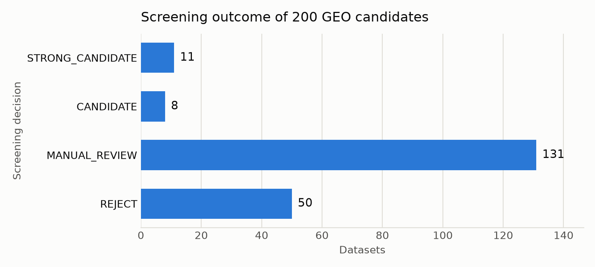

# NAFLD Transcriptomics Dataset Collection

This repository is a Week 1 Machine Learning internship deliverable for Survom: identify, validate, download, organize, and document **bulk** transcriptomics datasets related to Non-Alcoholic Fatty Liver Disease (NAFLD) from NCBI GEO.

It contains two things:

1. **`geo_screen`** — a small, reusable Python CLI that searches GEO, fetches Series/Sample metadata, runs a fixed set of technical checks, and classifies each dataset with a traceable reason. Every verdict points back to a specific GEO metadata field or a named rule in the code, so any classification can be checked by hand.
2. **`survom_nafld/`** — the curated collection the tool produced, plus the decisions made on top of it.

## Purpose

The assignment explicitly warns against downloading "as many datasets as possible." The goal here is a small, well-justified, reproducible collection of **bulk** RNA-seq datasets, with single-cell/single-nucleus/spatial studies, cell-line models, and other unsuitable material correctly excluded or flagged for review where the evidence is ambiguous.

## Quick start

```bash
python3 -m venv .venv && .venv/bin/pip install -e ".[dev]"
.venv/bin/python -m pytest                                    # 72 tests, offline, no network

.venv/bin/python -m geo_screen search --query-file queries.txt --out survom_nafld
.venv/bin/python -m geo_screen screen --file survom_nafld/candidates/accessions.txt --out survom_nafld
.venv/bin/python -m geo_screen download --file survom_nafld/selected.txt --out survom_nafld
```

Three reporting scripts sit outside the CLI. The first two read what is already in the tree and never
touch the network; `plot_screening.py` is the only thing here that needs matplotlib:

```bash
.venv/bin/pip install -e ".[plots]"
.venv/bin/python scripts/plot_screening.py            # assets/screening_overview.png and .svg
.venv/bin/python scripts/extract_design.py            # survom_nafld/reports/experimental_design.csv
.venv/bin/python scripts/fetch_supplementary_types.py # candidates/supplementary_files.csv, --offline to replay
```

Screening ~200 GSEs takes a few minutes on the first run (NCBI rate-limits to 3 requests/second, or 10/second with `NCBI_API_KEY` set) and is near-instant afterward, since every fetch is cached under `.geo_cache/`. `--offline` forces a run to use only what's already cached, which is how the whole pipeline can be reproduced with no network access at all.

## GEO search strategy

Two queries, run against `db=gds` via NCBI E-utilities on 2026-08-13 (see `survom_nafld/candidates/search_manifest.json`):

```
NAFLD AND "Homo sapiens"[Organism] AND "expression profiling by high throughput sequencing"[DataSet Type]
(MASLD OR MASH OR NASH) AND "Homo sapiens"[Organism] AND "expression profiling by high throughput sequencing"[DataSet Type] AND liver[All Fields]
```

The first query mirrors an earlier manual GEO search that returned 99 hits; this run returned 100, so the pool has grown slightly since then. The second broadens recall to the MASLD/MASH/NASH synonym family with an explicit `liver` term, following the assignment's own list of related terms. Together the two queries returned 200 unique GSE accessions (`survom_nafld/candidates/candidates.csv`, deduplicated by accession). Both queries are committed verbatim in `queries.txt`, which is what `search` actually reads.

Human liver studies are the priority, but "human only" isn't hard-coded into the search: the query text only restricts to `"Homo sapiens"[Organism]`, and the classifier doesn't reject non-human datasets outright either — see Selection policy below.

## Inclusion/exclusion criteria

`screen` runs 14 checks per dataset (implemented in `rules.py`/`classify.py`), summarized here in plain terms; the exact patterns live in the code rather than being duplicated in this document.

**Thresholds:** a `STRONG_CANDIDATE` needs at least 20 samples and a liver-pattern source name on at least 95% of them.

**Disease relevance:** the sample and series metadata are checked for NAFLD-spectrum terms — NAFLD, MASLD, NASH, MASH, steatosis/steatohepatitis, fibrosis staging, NAFLD Activity Score, Kleiner scoring, and related phrasing.

**Single-cell/spatial exclusion:** a dataset is rejected as not bulk if its sample metadata names a single-cell platform or tool (10x/Chromium, Cell Ranger, Seurat, Smart-seq, snRNA/scRNA, Visium, and similar), or if a supplementary filename matches a single-cell/spatial file format (`matrix.mtx`, `barcodes.tsv`, `.h5ad`, `.loom`, and the like). If that language only shows up in the series title or abstract — not in any individual sample's record — it's downgraded to a warning rather than an outright rejection, since bulk papers often reference single-cell work by other groups in their background section without using it themselves. `GSE213621` below is a real case where that distinction matters.

**Cell-line/culture exclusion:** the same structural-vs-textual logic applies to non-tissue material — HepG2, Huh-7, HepaRG, and other common liver cell lines, organoids, and in-vitro culture terms. A hit in the sample record itself is treated more seriously than a mention only in the series description.

**Classification precedence:** a hard `FAIL` on single-cell/spatial, disease relevance, library strategy, or expression-data availability sends a dataset straight to `REJECT`. Any remaining `WARN` sends it to `MANUAL_REVIEW`. A human GEO dataset that passes every check with a sufficient sample count becomes `STRONG_CANDIDATE`; everything else that's still viable is `CANDIDATE`, with the specific unmet conditions listed.

## Selection policy (a curation choice, not a biological rule)

Non-human organism is never an automatic rejection: Survom's own brief notes that GEO holds NAFLD-relevant studies across species, and a mouse NAFLD model is real, valid biology — just not equivalent to human disease. A non-human dataset is screened and scored like any other; it's simply capped at `CANDIDATE` rather than `STRONG_CANDIDATE`, with that reason recorded explicitly.

Keeping non-human datasets out of the downloaded collection is a scope decision for this assessment, not a claim that they're invalid — the brief centers on human disease, and enough human `STRONG_CANDIDATE` datasets were available that non-human inclusion wasn't needed. Across the 200 screened, no candidate reached `STRONG_CANDIDATE` or `CANDIDATE` on an exclusively non-human basis in a way that would have changed this. A few human/mouse mixed-organism series (e.g. `GSE267145`, 448 human + 60 mouse samples) landed in `MANUAL_REVIEW` instead, discussed below.

## Screening workflow

1. `search` queries `esearch`/`esummary` (db=gds) and writes `candidates/candidates.csv`, `candidates/accessions.txt`, `candidates/search_manifest.json`.
   - `candidates.csv`'s `suppfile` column is the esummary field of the same name. It is a series-level roll-up of file types, not a type per file: GSE135251 ships a single `GSE135251_RAW.tar`, and esummary reports `TXT` because it looks through the tar at its members. `scripts/fetch_supplementary_types.py` adds the per-file view, reading the `File type/resource` column of each Series record page (`acc.cgi`), which is the only GEO surface that states a type per file. It writes `candidates/supplementary_files.csv` (one row per file, with GEO's filename, type, size and download URL verbatim) and appends `supplementary_files` and `geo_raw_data_status` to `candidates.csv`. No type is derived from a filename or extension; where GEO leaves the cell empty the value is `Not specified by GEO`, and where GEO lists no files at all it is `None reported by GEO`. Across the 200 candidates GEO reports 339 supplementary files for 193 accessions, every one of them with an explicit type, and no supplementary files for the remaining 7. These columns describe what GEO publishes, not what this repository downloaded; downloaded files are recorded per dataset in `download_manifest.json`.
2. `screen` fetches each GSE's `*_family.soft.gz` (one request per series covers every sample's metadata) plus two small FTP directory listings, runs the 14 checks, classifies the series, and writes `series_metadata.json`, `sample_metadata.csv`, `validation_report.md`, and `source_manifest.json` under `datasets/<GSE>/`, along with the aggregate `reports/summary.csv` and `reports/screening_report.md`.
3. `reports/screening_report.md` is reviewed by hand, the `MANUAL_REVIEW` entries worth resolving are worked through, and the final picks go into `selected.txt`.
4. `download` fetches only the selected accessions — screening itself never pulls bulk data.

**Result:** 200 candidates screened, 11 `STRONG_CANDIDATE`, 8 `CANDIDATE`, 131 `MANUAL_REVIEW`, 50 `REJECT`. All 200 fetches succeeded. Every candidate has a full validation report under `survom_nafld/datasets/<GSE>/`.



Final selection: 9 datasets, consisting of 8 STRONG_CANDIDATE datasets and 1 manually reviewed inclusion (GSE213621).

`scripts/plot_screening.py` counts the `decision` column of `reports/summary.csv` and refuses to plot unless the four tiers account for every row, so the figure cannot drift from the screening results. It also joins `selected.txt` against those decisions and prints the final-selection breakdown above, which is why that line is checkable rather than asserted.

The 50 rejections break down by triggering check: `single_cell_or_spatial` (45 — by far the dominant reason, and the exact failure mode the assignment calls out by name), `library_strategy` (2 — non-expression assays such as Bisulfite-Seq- or ChIP-seq-only series), `disease_relevance` (2), `expression_data_availability` (1).

## Selected datasets (9)

Eight of the nine are `STRONG_CANDIDATE`; the ninth, `GSE213621`, is a `MANUAL_REVIEW` resolved by hand (see below). Rationale and metadata distribution for each dataset are in `survom_nafld/datasets/<GSE>/README.md`; the full checks table is in the adjacent `validation_report.md`.

| Accession | n | Decision | Why it's here |
|---|---|---|---|
| [GSE135251](survom_nafld/datasets/GSE135251/README.md) | 216 | STRONG_CANDIDATE | Flagship multicenter cohort; largest classic case-control design; full NAFL/NASH F0–F4 fibrosis spectrum |
| [GSE213621](survom_nafld/datasets/GSE213621/README.md) | 368 | MANUAL_REVIEW → included | Largest cohort in the collection; fibrosis-staged; resolved by hand (see "Manual-review resolutions") |
| [GSE174478](survom_nafld/datasets/GSE174478/README.md) | 94 | STRONG_CANDIDATE | Japanese NASH cohort, full F0–F4 spectrum; the only non-Western population in the collection |
| [GSE162694](survom_nafld/datasets/GSE162694/README.md) | 143 | STRONG_CANDIDATE | NASH fibrosis with cell-type composition deconvolution; a distinct analytical design, not just another cohort |
| [GSE281797](survom_nafld/datasets/GSE281797/README.md) | 94 | STRONG_CANDIDATE | Obese cohort whose diagnosis field spans no pathology (30), MASL (53) and MASH (11) |
| [GSE167523](survom_nafld/datasets/GSE167523/README.md) | 98 | STRONG_CANDIDATE | Independent NAFLD cohort, previously vetted by hand; a different metadata shape (no fibrosis staging) from the rest |
| [GSE150026](survom_nafld/datasets/GSE150026/README.md) | 78 | STRONG_CANDIDATE | Tesamorelin RCT in HIV-associated NAFLD; the only interventional design and the only distinct comorbid population |
| [GSE126848](survom_nafld/datasets/GSE126848/README.md) | 57 | STRONG_CANDIDATE | Healthy-normal-weight / obese-without-NAFLD / NAFL / NASH four-arm design; the only dataset separating obesity from NAFLD as distinct groups |
| [GSE130970](survom_nafld/datasets/GSE130970/README.md) | 78 | STRONG_CANDIDATE | Full NAS-component and fibrosis-stage histology reported per sample, across the complete disease spectrum |

Study structure for each of the nine is in `survom_nafld/reports/experimental_design.csv`, one row per dataset with the summary next to the GEO fields it was written from (Series overall design, Series summary, Series relations, observed sample-group counts). The summaries themselves live in `survom_nafld/design_notes.csv` and are curated by hand from those fields; `scripts/extract_design.py` joins the two and fails if a count in a summary appears nowhere in that dataset's record.

**Why these nine and not more.** Eleven datasets reached `STRONG_CANDIDATE`. Eight are in the table above; the ninth slot went to `GSE213621` from `MANUAL_REVIEW` instead, because at 368 samples it's the largest cohort in the collection and its fibrosis staging holds up under manual review (below). That leaves three `STRONG_CANDIDATE`s out, for different reasons:

- **`GSE272035`** (71 samples) — a hepatocellular-carcinoma etiology study (viral vs. metabolic HCC). Only 16 of 71 samples are NAFLD-positive, the tissue is tumor rather than the liver-disease spectrum this collection targets, and its `disease` field is a coarse yes/no flag rather than staged severity. Including it would dilute the collection's focus rather than add coverage.
- **`GSE234415`** (36 samples) — an ex-vivo NRF2-activator drug trial across only 12 independent patients. `GSE150026` already covers the interventional/comorbid-population angle at a larger, cleaner sample size, so adding this one wouldn't extend the collection's coverage.
- **`GSE239422`** (125 samples) — real human liver bulk RNA-seq, but every sample's `disease` field reads `Obese`: the cohort is bariatric-surgery patients stratified by sex and PNPLA3 rs738409 genotype, so its purpose is a mechanistic susceptibility question rather than the disease spectrum this collection targets. It was downloaded and reviewed before being dropped at final review; its files and a note explaining the decision remain under `survom_nafld/datasets/GSE239422/`.

`CANDIDATE`-tier datasets (`GSE193084`, `GSE268273`, and others) are excluded for a structural reason, not a judgment call: they only have raw sequencing reads on GEO, no processed expression matrix, so satisfying requirement 4 ("download the appropriate expression data files") would mean running an alignment pipeline rather than curating an existing dataset.

`GSE126848` and `GSE130970` each add coverage none of the others provide. `GSE126848` is the only dataset in the collection with both a healthy-normal-weight control arm and an obese-without-NAFLD control arm reported separately (14 and 12 subjects) — the only way in this collection to separate the effect of obesity itself from the effect of NAFLD/NASH, directly matching the assignment's own example comparison of "healthy/control" versus "NAFLD/NASH" samples. `GSE130970` reports every individual NAS component (steatosis, lobular inflammation, ballooning) separately per sample rather than only the composite score, alongside fibrosis staging, across a general NAFLD cohort spanning the full severity spectrum — useful for modeling severity on its constituent parts rather than a single composite number. (`GSE281797` reports the same per-component detail for its own, differently-focused early-stage/obese cohort — see its README.)

## Manual-review resolutions

131 datasets landed in `MANUAL_REVIEW`. Given the volume, review focused on the ones large enough to plausibly change the collection, plus a scan for any large dataset flagged only because of a metadata-mapping gap. This isn't exhaustive — `reports/screening_report.md` lists every one with its triggering reason for anyone continuing this work.

**`GSE213621` (368 samples) — resolved and included.** It is the human SubSeries of SuperSeries `GSE213623` (recorded as `SubSeries of: GSE213623` in its `series_metadata.json`); the parent study's mouse single-cell work sits in a separate SubSeries and is not part of this GSE, whose 368 samples are all human bulk RNA-seq. In the **first** screening run it was flagged on `metadata_completeness`, because the series reports fibrosis staging under the raw characteristic key `fibrotic stage` (e.g. `fibrotic stage: F2`), an adjective form the synonym table hadn't accounted for — only `fibrosis stage` was recognized. Adding `fibrotic stage`/`fibrosisscore` as `fibrosis_stage` synonyms and `patient diagnosis` as a `diagnosis` synonym in `rules.py` fixed the mapping and, on re-screening the full pool, brought two more datasets (`GSE150026`, `GSE272035`) up to `STRONG_CANDIDATE` as well. **In the shipped record that check passes** (`fibrotic stage: 368/368`, canonicalized to `fibrosis_stage`), and the two remaining flags are `disease_relevance` and `single_cell_or_spatial`. `disease_relevance` is a legitimate warning rather than a bug: individual sample records say `liver cells` / `fibrotic stage: F2` without spelling out NAFLD by name, while the series title does — exactly the case where sample-level evidence should outrank series-level prose, and exactly what `MANUAL_REVIEW` exists to catch. `single_cell_or_spatial` fired on the SuperSeries prose describing the mouse single-cell work; `library_strategy` is RNA-Seq across all 368 human samples with no single-cell platform, tool or file-format signal in any individual record. `GSE213621` still landed short of `STRONG_CANDIDATE` on those two warnings, so including it here is a manual call layered on top of the corrected metadata, not an automatic promotion — made on its size and genuine fibrosis staging.

**A second, similar synonym gap was found in `GSE281797`'s own metadata.** Its samples report fibrosis staging under the raw key `fibrosis grade` (values 0-3 across all 94 samples), a variant the synonym table hadn't accounted for even after the `fibrotic stage` fix above — so `metadata_completeness` listed `fibrosis_stage` as unreported for this dataset even though the raw data was there. Adding `fibrosis grade` as a `fibrosis_stage` synonym in `rules.py` and re-screening the full pool again fixed the mapping with no other classification changes (`GSE281797` was already `STRONG_CANDIDATE` on other grounds).

**Large mixed-organism and mixed-assay series were left unresolved.** `GSE267145` (508 samples: 448 human + 60 mouse), `GSE246223`/`GSE246221` (human + mouse), and `GSE105127` (114 samples: 57 Bisulfite-Seq + 57 RNA-Seq) each contain a genuine bulk-RNA-seq human subset worth extracting, but the tool currently screens each GSE as one unit and has no way to evaluate a subset of samples within a series. Adding that would mean sample-level subsetting, which is out of scope here; flagging it as the most promising direction for anyone extending this collection.

**Everything else in `MANUAL_REVIEW`** is left for further review, prioritized by sample count in `reports/screening_report.md`. The nine selected datasets already meet the collection's goals, so no further promotions were forced.

**Known limitation in disease-term matching.** `disease_relevance` looks for NAFLD-spectrum terms as a substring of the raw characteristic text, so a value like `nash: no` still counts as a match on the word "nash," even though it means the sample does *not* have NASH — the clearest example in the pool is `GSE239422` (screened, not selected), where every sample is labeled "Obese" and the series still passes `disease_relevance` on its `nash` field regardless of the actual yes/no value. It doesn't change any classification outcome in this run, since a genuinely relevant series still needs some real disease-spectrum content elsewhere to pass, and the underlying raw value is always visible in the checks table for manual review — but a `PASS` here should be read as "a disease term appears in this field," not "this sample has the disease."

## Rejected datasets and reasons

Full list with reasons: `survom_nafld/reports/screening_report.md`. By triggering check: `single_cell_or_spatial` (45 of 50 — 10x/Chromium/Cell Ranger protocols, single-nucleus isolation, or single-cell file formats found directly in sample records), `library_strategy` (2 — no RNA-Seq samples at all), `disease_relevance` (2 — no NAFLD-spectrum term anywhere), `expression_data_availability` (1 — no processed data and no sequencing reads either).

## Download process and caveats

`download` is a separate, explicit step from `screen` — screening never pulls large files. It fetches exactly the accessions listed in `selected.txt`, with one exception on disk: `GSE239422` was downloaded while it was still a selection and was dropped at final scientific review, so its files remain under `datasets/GSE239422/` although it is no longer listed. For each selected GSE:

1. **Tier 1:** series-level supplementary files matching `counts|matrix|tpm|fpkm|rpkm|expression|cpm|.csv|.tsv|.txt` go to `expression/`. NCBI's auto-generated `filelist.txt` directory index also matches this pattern and is explicitly excluded — it was initially downloaded by mistake for `GSE135251` and turned out to be nothing but a file listing.
2. **Tier 1b:** phenotype/clinical files and the series matrix go to `metadata/`.
3. **Tier 2** (only if Tier 1 found nothing): the series `_RAW.tar` is downloaded to `archives/` — this is GEO's archive of per-sample submitted files, not raw FASTQ — and only its processed count files are extracted into `expression/` (216 per-sample `.counts.txt.gz` files for `GSE135251` this way). Extraction uses Python 3.12's hardened `filter="data"`, which rejects path traversal, absolute paths, and symlinks in archive members.
4. SRA/FASTQ is never downloaded — links are recorded in `download_manifest.json` and the `raw_sra_availability` check only.
5. Anything over the 500 MB default `--max-file-size` is skipped, with the reason logged.

**Filenames from network listings are treated as untrusted input.** Every filename `download` writes to disk comes from parsing either an FTP directory listing or a `Sample_supplementary_file` field in a SOFT record — both free text from the network. A path-traversal review found that these names were joined onto a local directory path without validation: `Path.__truediv__` doesn't sanitize `..` components, and for an absolute-looking name (or, on Windows, a drive-qualified name like `D:evil`) it silently discards the destination directory entirely rather than raising an error. `download.py` now rejects any filename containing a path separator, a colon, or an exact `..`/`.` component, both when a download plan is built and again at the point a name is turned into an actual filesystem path, so the check holds even if a plan is constructed directly rather than through the normal flow. This is separate from, and in addition to, the tar-extraction hardening above — that one covers a malicious archive's internal member names, this one covers a malicious or malformed directory listing.

**Series matrix presence isn't the same as expression data being present.** Every selected dataset's samples are `Sample_type = SRA` with zero data rows in the series matrix, so the `series_matrix` check reports it as present but metadata-only, and `expression_data_availability` is evaluated independently from the actual supplementary-file evidence rather than from the matrix file's existence.

**Feature identifiers are not unique in every matrix.** Every downloaded expression file was checked for duplicate row identifiers, including all 216 per-sample count files for `GSE135251`. Among the nine selected datasets, six have fully unique feature identifiers and three do not: `GSE174478` (44 duplicated Ensembl IDs whose rows are byte-identical, so deduplication is lossless), `GSE213621` (5 duplicated gene symbols with differing values) and `GSE167523` (2 duplicated date-like labels with differing values). The repository also retains `GSE239422`, reviewed and then dropped from the collection; its two expression matrices were swept as well and contain no duplicate feature identifiers. Nothing was removed or merged — every matrix is stored exactly as GEO serves it — and each affected dataset's `README.md` records the specifics and what a deduplication policy has to account for.

All nine downloads are verified: every directly-downloaded file's sha256 in its `download_manifest.json` matches the file on disk, and for `GSE135251` (the one dataset that came from `_RAW.tar` extraction rather than a direct download) every one of the 216 extracted per-sample files listed in the manifest is present. For every dataset that ships an expression matrix, the sample-column count matches the `sample_metadata.csv` row count exactly, once the leading gene-annotation columns are discounted — one in most files, four in `GSE281797`'s TPM matrix, none in `GSE213621`'s FPKM matrix, whose header row is sample names only.

## Reproducibility

```bash
python3 -m venv .venv
.venv/bin/pip install -e ".[dev]"
.venv/bin/python -m pytest                       # 72 tests, all offline, ~2s

# Optional: set NCBI_API_KEY in the environment for a 10 req/s rate limit instead of 3 req/s.

.venv/bin/python -m geo_screen search --query-file queries.txt --out survom_nafld
.venv/bin/python -m geo_screen screen --file survom_nafld/candidates/accessions.txt --out survom_nafld
.venv/bin/python -m geo_screen download --file survom_nafld/selected.txt --out survom_nafld
```

The first `screen` run takes a few minutes (200 GSEs, three requests each, rate-limited). Every later run against the same `.geo_cache/` finishes in seconds, and `--offline` reproduces it with zero network calls — the full 200-candidate pool was re-screened offline in about seven seconds to verify the `rules.py` fix above, instead of re-fetching everything.

```bash
.venv/bin/python -m geo_screen GSE135251 --out /tmp/run1
.venv/bin/python -m geo_screen GSE135251 --out /tmp/run2 --offline
diff -rq /tmp/run1/datasets /tmp/run2/datasets
```

The only file that differs between the two runs is `source_manifest.json`, and only in fields that are supposed to change between invocations — the recorded `argv` and the cache provenance (`from_cache`, `retrieved_at`). `series_metadata.json`, `sample_metadata.csv`, and `validation_report.md` are byte-identical.

## Folder structure

```
source/
├── queries.txt                 # the exact GEO queries used
├── src/geo_screen/             # the tool
├── scripts/                    # reporting scripts outside the CLI: plot_screening, extract_design,
│                               #   fetch_supplementary_types
├── assets/                     # screening_overview.png and .svg, generated from reports/summary.csv
├── tests/                      # 72 tests, real trimmed SOFT and GEO-page fixtures, no network
└── survom_nafld/
    ├── candidates/              # search output: candidates.csv, accessions.txt, search_manifest.json
    │                            #   plus supplementary_files.csv + supplementary_manifest.json,
    │                            #   GEO's per-file supplementary types for all 200
    ├── selected.txt             # the 9 selected accessions, one per line, with reasons
    ├── design_notes.csv         # hand-written study-structure summary per selected dataset
    ├── datasets/<GSE>/
    │   ├── series_metadata.json
    │   ├── sample_metadata.csv
    │   ├── validation_report.md
    │   ├── source_manifest.json
    │   ├── README.md            # downloaded datasets only, written by hand from the above
    │   ├── metadata/             # series matrix, phenotype/clinical files
    │   ├── expression/           # usable processed counts/TPM/FPKM matrices
    │   ├── expression_sample_map.csv  # GSE126848 only: matrix sample column ↔ GSM
    │   └── archives/             # downloaded _RAW.tar, gitignored (re-fetchable via the manifest)
    └── reports/
        ├── summary.csv           # one row per screened GSE
        ├── screening_report.md   # counts by decision, full table, rejected-with-reasons
        └── experimental_design.csv  # design summary + the GEO fields behind it, for the 9
```

## Architecture notes

`geo_screen` fetches exactly one `*_family.soft.gz` per GSE — every sample's metadata is in that one file, so there's no per-sample scraping — plus two small FTP directory listings. The only runtime dependency is `requests`; everything else (CSV/JSON handling, characteristic-field normalization) is the standard library. The 14 checks each produce a PASS/WARN/FAIL/INFO status with an observed value and, where relevant, evidence naming the exact SOFT field and matched text, so every number in a report traces back to a specific field in a specific GEO record rather than to a hand-typed figure. Classification itself is a pure function over the 14 check results, evaluated in fixed precedence, with no access to the network and no input besides the check outcomes.
